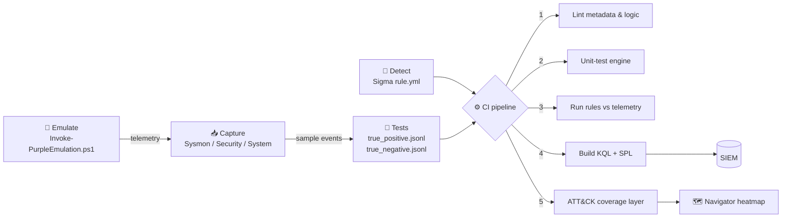

<div align="center">

# 🟣 Detection-as-Code Purple Lab

**Every detection is code. Every detection is tested. Every detection is proven against a real attack.**

[](https://github.com/engziyad/detection-as-code-purple-lab/actions/workflows/detection-ci.yml)


</div>

---

## The problem this solves

Most SOCs and most security portfolios share the same weakness: detection rules are written once, pasted into a SIEM, and **never proven to work**. Nobody knows whether a rule still fires after a tuning change, whether it was ever tested against the attack it claims to catch, or what it silently misses.

This lab treats detections like production software:

| Typical rule repo | This lab |
|---|---|
| Rules pasted into a SIEM | Rules in Git, reviewed through pull requests |
| "It should work" | **51 test cases** (true-positive *and* true-negative) run on every commit |
| One SIEM language | One Sigma source → **KQL (Sentinel/Defender)** and **SPL (Splunk)** automatically |
| Hand-drawn coverage maps | **ATT&CK Navigator layer generated from tested rules only** |
| Attack and defense in separate silos | Each rule ships with a **safe emulation** that produces its telemetry |
| No mention of blind spots | Every rule documents **how an attacker evades it** and what covers the gap |

## How it works



1. **Emulate** an ATT&CK technique on a lab VM with a safe, self-cleaning script.
2. **Capture** the resulting events and store representative samples as JSON test fixtures.
3. **Write** the detection once in [Sigma](https://sigmahq.io/).
4. **CI proves it**: the rule must fire on every malicious sample and stay silent on every benign one.
5. **Ship**: the pipeline emits ready-to-deploy KQL and SPL plus an updated coverage map.

## Quick start

```bash
git clone https://github.com/engziyad/detection-as-code-purple-lab.git
cd detection-as-code-purple-lab
pip install -r requirements.txt

make ci          # lint + unit tests + detection tests + build queries + coverage
```

Example output:

```
T1059.001_powershell_encoded_command
  [PASS] TP  classic -enc
  [PASS] TP  abbreviation -ec with slash style
  [PASS] TP  renamed binary caught via OriginalFileName
  [PASS] TN  -ExecutionPolicy is not -EncodedCommand
  [PASS] TN  SCCM agent
...
51/51 test cases passed across 8 detections
```

Convert a single rule:

```bash
python tools/convert.py --backend kql --rule "detections/T1003.001_*/rule.yml"
```

## Detection catalog

| Tactic | Technique | Detection | Severity | Highlights |
|---|---|---|---|---|
| Execution | [T1059.001](detections/T1059.001_powershell_encoded_command/) | PowerShell encoded command | medium | Regex defeats parameter-abbreviation and Unicode-dash evasion; catches renamed binaries |
| Persistence | [T1053.005](detections/T1053.005_schtasks_suspicious_creation/) | Suspicious scheduled task | medium | Flags payload location, interpreters and remote SYSTEM tasks, not every task |
| Persistence | [T1547.001](detections/T1547.001_registry_run_key_persistence/) | Run key persistence | medium | Key **and** data must be suspicious, known per-user apps filtered |
| Defense Evasion | [T1218.011](detections/T1218.011_rundll32_suspicious_execution/) | Rundll32 proxy execution | high | Four abuse patterns incl. no-argument injection host |
| Defense Evasion | [T1070.001](detections/T1070.001_event_log_clearing/) | Event log clearing | high | wevtutil, PowerShell, .NET and WMIC methods |
| Credential Access | [T1003.001](detections/T1003.001_lsass_memory_access/) | LSASS memory access | high | Access-mask based; does **not** blindly trust System32 (comsvcs bypass) |
| Credential Access | [T1558.003](detections/T1558.003_kerberoasting_rc4_tgs/) | Kerberoasting (RC4 TGS) | medium | Single-event rule plus aggregation hunt |
| Lateral Movement | [T1569.002](detections/T1569.002_suspicious_service_installation/) | PsExec-style service install | high | Fingerprints PsExec, Impacket psexec/smbexec |

Full matrix: [`docs/COVERAGE.md`](docs/COVERAGE.md) · Heatmap: import [`coverage/attack_navigator_layer.json`](coverage/attack_navigator_layer.json) into [ATT&CK Navigator](https://mitre-attack.github.io/attack-navigator/).

Every detection folder contains:

```
detections/T1003.001_lsass_memory_access/
├── rule.yml                    # Sigma rule (single source of truth)
├── README.md                   # telemetry, logic, evasion gaps, tuning, SOC triage, emulation
└── tests/
    ├── true_positive.jsonl     # must ALL trigger
    └── true_negative.jsonl     # must NEVER trigger
```

## Repository layout

```
.
├── detections/                 # one folder per ATT&CK technique
├── emulation/
│   └── Invoke-PurpleEmulation.ps1   # safe, self-cleaning attack emulation (lab only)
├── tools/
│   ├── sigma_engine.py         # offline Sigma evaluator (no SIEM needed for tests)
│   ├── run_tests.py            # detection unit tests, JUnit + GitHub job summary
│   ├── validate.py             # quality gate: metadata, ATT&CK tags, logic, mappings
│   ├── convert.py              # Sigma → KQL / SPL
│   ├── mappings.yml            # per-environment field & table mapping
│   ├── coverage.py             # ATT&CK Navigator layer + coverage matrix
│   └── new_detection.py        # scaffold a new detection
├── queries/                    # generated KQL / SPL (checked for drift in CI)
├── coverage/                   # generated ATT&CK Navigator layer
├── tests/                      # unit tests for the engine and converter
├── docs/                       # architecture, methodology, authoring guide
└── .github/workflows/          # Detection CI
```

## Purple-team workflow

```powershell
# On an isolated lab VM with Sysmon + log forwarding
.\emulation\Invoke-PurpleEmulation.ps1 -Technique T1059.001,T1547.001,T1053.005 -LabConfirmed
```

Each run tags its artifacts with a unique marker and writes `emulation-results.json` with UTC timestamps, so you can search the SIEM for the marker and measure **detection latency** and **hit rate** per technique. The full loop is described in [`docs/PURPLE_TEAM_WORKFLOW.md`](docs/PURPLE_TEAM_WORKFLOW.md).

## Adding a detection

```bash
make new ID=T1110.003 NAME=password_spraying
```

The scaffold intentionally **fails the linter** until every `TODO` is replaced, so incomplete rules can never reach `main`. See [`docs/WRITING_DETECTIONS.md`](docs/WRITING_DETECTIONS.md).

## Documentation

- [Architecture](docs/ARCHITECTURE.md): how the engine, converter and pipeline fit together
- [Purple-team workflow](docs/PURPLE_TEAM_WORKFLOW.md): emulate → observe → detect → validate → tune
- [Writing detections](docs/WRITING_DETECTIONS.md): quality bar and conventions
- [Coverage](docs/COVERAGE.md): auto-generated ATT&CK matrix
- [الدليل بالعربي](docs/GUIDE_AR.md): شرح كامل للمشروع باللغة العربية

## Roadmap

- [ ] Correlation rules (Sigma v2 `correlation`) for Kerberoasting volume and password spraying
- [ ] Linux / auditd detections
- [ ] Elastic (EQL) backend
- [ ] Replay emulation telemetry from EVTX files directly in CI

## Disclaimer

The emulation script is for **isolated lab environments you own**. It is deliberately benign and self-cleaning, but it still generates real attack telemetry. No sample in this repository contains data from any real organization; all events are synthetic.

---

<div align="center">

Built by **Ziyad** · SOC L2 · eWPTX · eCPPT · RTO · [github.com/engziyad](https://github.com/engziyad)

</div>
