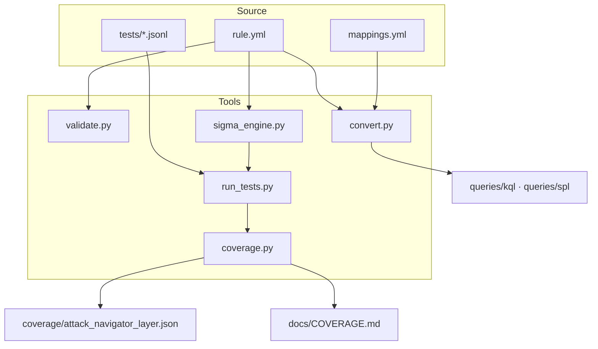

# Architecture

## Design goals

1. **Single source of truth.** A detection is written once, in Sigma, and every SIEM query is generated from it.
2. **Provable.** A rule is not "done" until it fires on real attack telemetry and stays quiet on realistic benign activity.
3. **Offline and portable.** The whole pipeline runs with Python and PyYAML. No SIEM licence, no cloud account, no network access is needed to validate a rule.
4. **Honest coverage.** Coverage maps are derived from *tested* rules, never typed by hand.

## Components

### `sigma_engine.py`: the offline evaluator

A small recursive-descent implementation of the Sigma matching semantics:

- **Selections**: a map is an AND across fields; a list of maps is an OR.
- **Values**: a list is an OR, unless the `|all` modifier makes it an AND.
- **Modifiers**: `contains`, `startswith`, `endswith`, `re`, `all`, `cased`, `exists`; plain values support `*` and `?` wildcards; `null` means "field absent".
- **Conditions**: `and`, `or`, `not`, parentheses, `1 of <pattern>`, `all of <pattern>`, `them`. `and` binds tighter than `or`, as in the Sigma specification.

Unsupported syntax raises `SigmaError` instead of silently evaluating to `False`. A rule the engine cannot understand fails CI loudly, which is the point.

The engine has its own unit tests (`tests/test_engine.py`) covering every modifier, operator precedence and error paths, so the test harness itself is tested.

### `convert.py`: Sigma to SIEM

The converter reuses the engine's tokenizer and grammar, so **the query in the SIEM has exactly the logic that passed the tests**. Backends implement one method, `predicate(field, modifiers, value)`, plus their boolean operators:

| Sigma | KQL | SPL |
|---|---|---|
| `contains` | `F contains @"v"` | `match('F', "(?i)v")` |
| `startswith` / `endswith` | `startswith` / `endswith` | anchored regex |
| `re` | `matches regex @"(?i)…"` | `match('F', "(?i)…")` |
| equality | `=~` (case-insensitive) | `lower('F')="v"` |
| `not X` | `not(X)` | `NOT (X)` |

SPL uses anchored regular expressions for substring operations because Windows paths are full of backslashes that make `like()` escaping error-prone.

`mappings.yml` maps each Sigma `logsource` to a base search/table and renames fields per backend (for example `EventID` → `EventCode` in Splunk). Moving the lab to a new environment means editing that one file.

### `validate.py`: quality gate

Fails the build if any rule has missing metadata, an invalid UUID or duplicate ID, no ATT&CK technique tag, a folder name that does not match its tags, a condition that references a non-existent selection, a logsource with no backend mapping, no README, no tests, or leftover `TODO` placeholders.

### `run_tests.py`: detection unit tests

Runs every rule against `true_positive.jsonl` (all must match) and `true_negative.jsonl` (none may match). Produces a coloured console report, an optional JUnit XML file, and a Markdown table in the GitHub Actions job summary.

### `coverage.py`: ATT&CK coverage

Builds an ATT&CK Navigator layer where a technique's score depends on rule severity **and** on whether its tests pass. Failing or untested rules are scored at half, so the heatmap never overstates real capability.

## CI pipeline

`.github/workflows/detection-ci.yml` runs on every push and pull request:

1. Lint rules
2. Unit-test the engine and converter
3. Run all detection tests (JUnit report uploaded as an artifact)
4. Generate KQL and SPL
5. Regenerate coverage
6. **Drift check**: fail if committed `queries/`, `coverage/` or `docs/COVERAGE.md` differ from what the rules generate

Step 6 guarantees that what reviewers read in the repository is exactly what the rules produce.
