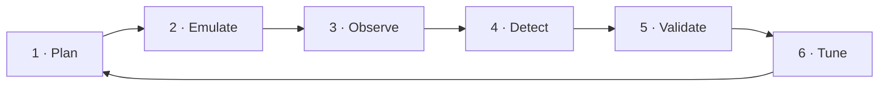

# Purple-Team Workflow

Purple teaming is not "red team plus blue team in the same room". It is a **measured feedback loop** in which every offensive action produces a defensive improvement that can be proven.



## 1 · Plan

Pick techniques by **threat relevance**, not by what is easy to detect. For each one, write down:

- the threat actors or malware families that use it,
- the telemetry you expect it to produce,
- whether that telemetry is actually collected today.

The third question alone often reveals the biggest gaps: a perfect rule on a log source you do not collect detects nothing.

## 2 · Emulate

Run the technique on an isolated lab VM:

```powershell
.\emulation\Invoke-PurpleEmulation.ps1 -Technique T1569.002 -LabConfirmed
```

The script stamps every artifact with a random marker (`purplelab_xxxxxxxx`), records UTC start and end times in `emulation-results.json`, and cleans up after itself.

For techniques the script does not cover, use [Atomic Red Team](https://github.com/redcanaryco/atomic-red-team) or your own C2 in the lab, and record the same timing information.

## 3 · Observe

Search the SIEM for the marker. Answer three questions:

| Question | If the answer is "no" |
|---|---|
| Did the event arrive at all? | Collection gap: fix Sysmon config, audit policy or forwarding |
| Does it contain the fields the rule needs? | Parsing / mapping gap: fix `mappings.yml` or the parser |
| Did an existing rule fire? | Detection gap: go to step 4 |

## 4 · Detect

Export the relevant events as JSON and add them to `tests/true_positive.jsonl`. Then collect **benign look-alikes** from normal production activity (admin tools, software updaters, management agents) for `tests/true_negative.jsonl`. Write the Sigma rule so both files pass.

Good rules key on **behaviour that the attacker cannot easily change** (access masks, parent-child relationships, protocol properties) instead of tool names or hashes.

## 5 · Validate

```bash
make ci
```

Then deploy the generated query and re-run the emulation. Record:

- **Hit**: did the alert fire?
- **Detection latency**: alert time minus `utc_start` from `emulation-results.json`.
- **Context quality**: does the alert contain enough to triage without pivoting?

## 6 · Tune

After deployment, every false positive in production becomes a new `true_negative` test case **before** the filter is added. This prevents the most common failure in SOCs: a filter added in a hurry that quietly disables the detection. If a tuning change breaks a true-positive test, CI blocks it.

Document what the rule still cannot see in the "Evasion & coverage gaps" section of its README, and feed those gaps back into step 1.

## Metrics worth reporting

| Metric | Definition |
|---|---|
| Validated technique coverage | Techniques with at least one rule whose TP tests pass, emulated in the lab in the last 90 days |
| Mean detection latency | Average time from emulation start to alert |
| Telemetry gap rate | Emulated techniques that produced no usable telemetry |
| Rule regression rate | Pull requests blocked by failing TP tests (higher means the safety net is working) |
